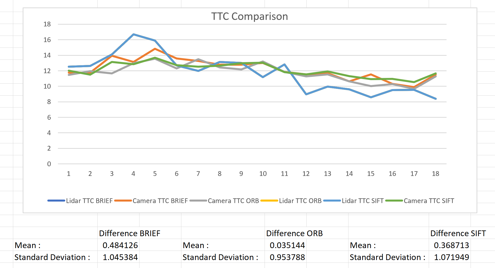

# SFND_3D_Tracking
3D Feature Tracking Project for the Sensor Fusion Nanodegree

- As suggested in the Mid Term [2D Tracking Project](https://github.com/Cedric-Perauer/SFND_2D_Tracking), the FAST detector was used with 
  BRIEF, ORB and SIFT detectors for robustness and real time capability 
- The Results can be found in the data.csv file 

## FP5 
- the Lidar TTC never seems to be way off, the median estimation is working in a solid way however this could obviously still be 
  improved by for example using a RANSAC to calculate the position of the closest point and become more robust against outliers 
- even a RANSAC approach might have problems in certain cases (maybe a Truck with an open trailer that has cargo which leads to a very lobsided estimation boundary)
- in a real world application that is one of the main things we should think about/research even further

## FP6 

## Comparison Chart 

In all 3 cases a FAST detector is used as suggested in the Mid Term project. 
The absolute difference between each Lidar and Camera TTC estimation was computed in a seperate document, 
consequently the mean and standard deviation were computed for each of the 3 cases. 

We can see that ORB provides the fastest computation time, while also having a the smallest difference between both TTC calculations by far. 
The standard deviation of the differences is also the lowest of all 3 calculations. 
It's also worth mentinong the difference in computation time between Binary Detectors and the HoG based SIFT. 
